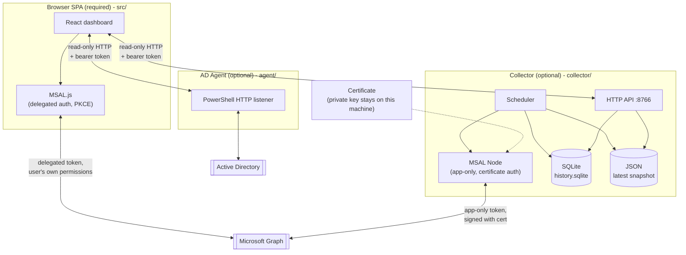
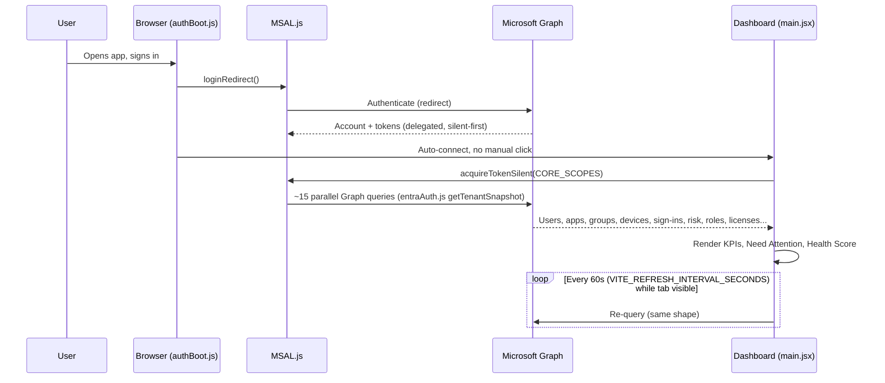
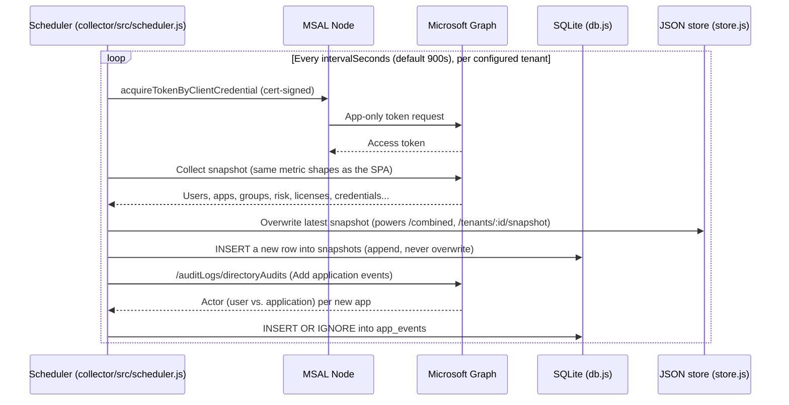
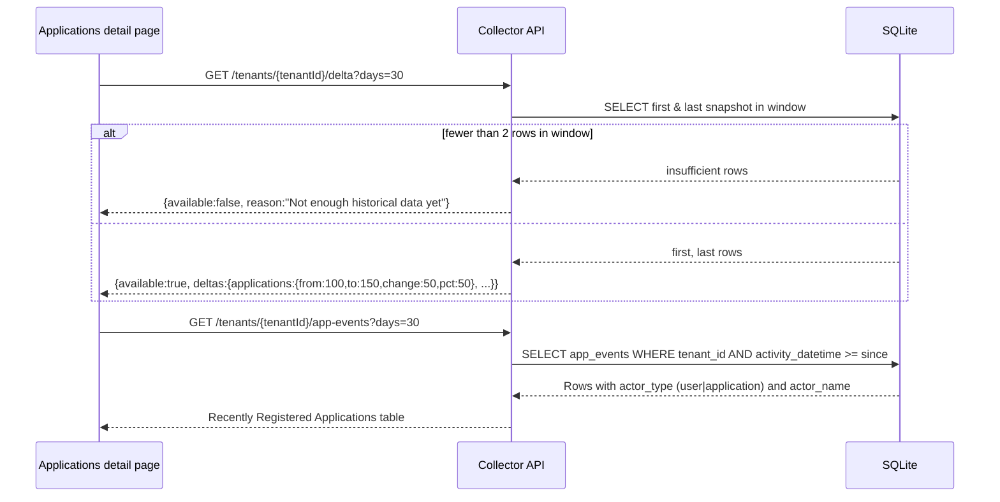

# IAM Intelligence — Technical Architecture & Metric Reference

This is the companion reference for engineers and reviewers: how the system
is put together, how data moves through it, and — for every panel on the
dashboard — exactly where its number comes from and what green/amber/red
actually means. If a panel isn't listed here with a source endpoint, treat
any color or claim on it as decorative, not a security signal.

## 1. System architecture

There are three independent runtimes. Only the first is required; the other
two are opt-in and add capabilities the first cannot provide by itself.



**Why three runtimes, not one:** a browser tab has no persistent process —
it cannot collect data when closed, cannot hold a private key safely, and
cannot reach an on-prem domain controller. Each optional runtime exists to
remove exactly one of those constraints, not to add unrelated features:

| Runtime | Removes the constraint that... | Auth |
|---|---|---|
| Browser SPA | (baseline - always present) | Delegated, MSAL.js, user consent |
| Collector | ...nothing runs when the tab is closed; ...a secret can't safely live in a browser | App-only, MSAL Node, **certificate** (never a client secret) |
| AD Agent | ...a browser can't reach an on-prem LDAP directory | Shared bearer token over localhost/your network |

## 2. Data flow

### 2a. Single-tenant live view (what you see day-to-day)



Nothing here is stored anywhere. Close the tab and the next open starts
from zero — this view only ever answers "what does it look like **right
now**".

### 2b. Collector poll cycle (what makes history possible)



The distinction that matters: `store.js` (JSON) always holds only the
**latest** snapshot — that's what `/combined` and the Combined dashboard
use. `db.js` (SQLite) **appends** every cycle, which is the only place in
the product building real time-series. If the collector isn't running, the
browser SPA still works fully for live data — it just has no trend/delta
to show, and says so explicitly rather than guessing.

### 2c. Trend/delta request (what the SPA does with that history)



This only works if the collector happens to be configured to track the
**same tenant ID** you're currently viewing in the browser. If not, the
Applications page's Growth Trend card says so instead of showing nothing
unexplained.

## 3. Module map

```
src/                       Browser SPA (Vite + React, no backend)
  entraAuth.js             MSAL.js wrapper + getTenantSnapshot()/getLicenseSnapshot()
                            - every Graph query, every calculated metric, lives here
  dataSources.js            Source registry + fetch helpers for AD agent / collector
  main.jsx                  All UI: dashboard, detail pages, nav, exceptions
  authBoot.js                Auth gate shown before the dashboard mounts

collector/                 Optional Node service (cert auth, app-only)
  src/msal.js               Certificate-based token acquisition, cert expiry reporting
  src/graph.js               collectTenant() + fetchAppCreationEvents()
  src/db.js                  SQLite schema, appendSnapshot/getHistory/getDelta/app_events
  src/store.js                JSON latest-snapshot store (powers /combined)
  src/scheduler.js            Poll loop - ties graph.js + db.js + store.js together
  src/server.js                 HTTP API

agent/IAM-AD-Agent.ps1     Optional PowerShell service for on-prem Active Directory

scripts/bootstrap-server.ps1/.sh   Fresh-server setup: dashboard + optional collector
collector/scripts/generate-cert.js  Pure-JS certificate generation (no openssl needed)
collector/scripts/backup.ps1/.sh    Archives cert + tenants.json + SQLite history
collector/scripts/restore.ps1/.sh    Restores that archive onto a (new) machine
```

## 4. Metric reference — what's on screen, where it comes from, why it's colored that way

Legend: 🟢 good / confirmed-safe · 🟡 warning threshold · 🔴 critical
threshold · ⚪ no severity meaning (informational only) · — unavailable
(never a fabricated zero)

### Overview

| Panel | Source | Calculation | 🟢 | 🟡 | 🔴 | — |
|---|---|---|---|---|---|---|
| Total Users / Applications / Devices | `/users`, `/applications`, `/devices` (`$count=true`) | Raw `@odata.count` | n/a | n/a | n/a | Query failed |
| Sign-ins (7D) / Risky Sign-ins (7D) | `/auditLogs/signIns` filtered by date | Raw count | n/a | n/a | n/a | Often requires Entra ID P1/P2 - see `signInsReason` |
| Application Usage Overview (donut) | `/reports/servicePrincipalSignInActivities` (beta), matched to this tenant's own apps by `appId` | Bucketed by days since last activity | Active ≤30d | 31-180d inactive | >180d inactive | Beta report or app list unavailable |
| Need Attention | Computed in `EntraDashboard` from live fields, one row per finding | Non-zero value | (excluded - not a finding) | `level:'warning'` | `level:'critical'` | `value:null` shown as `—`, excluded from the header count |
| Identity Risk Overview (donut) | `/identityProtection/riskyUsers` | `users - riskyUsers` = not flagged | 0 confirmed risky users | n/a | ≥1 risky user | Requires ID Protection (commonly Entra ID P2) - shows explicit unavailable state, never a false green |
| Sign-in Overview (sparkline) | `/auditLogs/signIns` per-day counts, last 7d | Daily count | n/a | n/a | n/a | Same licensing gate as Sign-ins KPI |
| Identity Health Score | Average of available signals below (0-100) | See §5 | ≥80 "Good" | 60-79 "Needs attention" | <60 "At risk" | No signals available → `—`, label reads "Insufficient data" |
| Application Credential Expiry | `/applications` `keyCredentials`/`passwordCredentials` | Days until `endDateTime` | >90d remaining | 31-90d remaining | ≤30d remaining or expired | `Application.Read.All` missing |

### Users page

| Panel | Source | Calculation | Notes |
|---|---|---|---|
| Without MFA | `/reports/authenticationMethods/userRegistrationDetails` | `isMfaRegistered === false` | No color; a flat list, searchable |
| Stale Enabled Users | `/users` `signInActivity`, adjustable 30/60/180d in the page (fixed 90d on Overview) | `accountEnabled && lastSignInDateTime < cutoff` | "Never observed" ≠ "never used" - Graph only tracks from when your license started recording it |
| Without Manager | `/users?$expand=manager` | `accountEnabled && !manager` | Count only, no drill-down list yet |

### Applications page

| Panel | Source | Calculation | Notes |
|---|---|---|---|
| Application Inventory | Same as Overview's app-activity bucketing | Per-app bucket + credential expiry, filterable by status and adjustable credential threshold | 🔴 only applied to the credential-expiry column, using the page's own selectable threshold |
| Growth Trend | **Collector**: `/tenants/:id/delta` | First-vs-last snapshot in the SQLite window | Requires collector tracking this tenant - see §2c |
| Recently Registered Applications | **Collector**: `/tenants/:id/app-events` (from `/auditLogs/directoryAudits`) | Actor = `user` (a person, interactive) or `application` (automation) | Not available without the collector; Graph doesn't expose finer detail than user-vs-app |

### Risk Overview page

| Panel | Source | Notes |
|---|---|---|
| Risky Users table | `/identityProtection/riskyUsers` | 🔴 only on `riskLevel === 'high'`; medium/low shown without color (not "safe", just not the top tier) |
| Privileged Role Assignments | `/roleManagement/directory/roleAssignments` + `roleDefinitions`, matched by a display-name pattern (`administrator\|global reader\|security reader\|privileged role`) | Count only in this version - not yet broken out per user here (see Toxic Combinations for the per-user cross-reference) |

### Toxic Combinations page (new)

| Panel | Source | Calculation |
|---|---|---|
| Active Toxic Combinations | Cross-reference of `privilegedPrincipalIds` ∩ (`mfaMissingIds` ∪ `riskyIds` ∪ `staleIds`), joined by AAD object id | A privileged user needs **at least one** other live signal to appear - never inferred, never a guess |

### Licenses page

| Panel | Source | Notes |
|---|---|---|
| License Inventory | `/subscribedSkus` | No color; purchased/consumed/available/utilization are shown as plain numbers |
| Stale Licensed Accounts | `/users` `assignedLicenses` + `signInActivity`, fixed 90d | A licensed account with no recent sign-in - a reclamation candidate, not by itself a security finding |

### Combined (multi-tenant collector) view

| Panel | Source | Notes |
|---|---|---|
| Per-Tenant Breakdown | Collector `/combined`, summed from the JSON latest-snapshot store | Same fields as single-tenant Overview, per tenant |
| Collector Certificate Health | Collector `/health`, reading the cert file's `notAfter` | 🔴 if `certExpiresInDays <= 30` |

### Risk Register page (new)

Not sourced from Graph at all - it's the audit trail of exceptions
acknowledged elsewhere (Need Attention, Toxic Combinations), stored in this
browser's `localStorage`. **Not yet shared across users** - each analyst
sees only their own acknowledgments until this is moved into the collector's
database (tracked as a known gap, not silently pretended to be solved).

## 5. Identity Health Score - exact formula

```
score = average of every AVAILABLE signal's sub-score (0-100 each):
  mfaCoverage      = (mfaRegistered / users) * 100
  riskyUserRate    = max(0, 100 - (riskyUsers / users) * 1000)
  inactiveAppRate  = max(0, 100 - ((inactive91to180 + inactive180) / ownAppCount) * 100)
  staleUserRate    = max(0, 100 - (staleUsers / users) * 100)
```

A signal is **excluded** from the average (not defaulted to 0 or 100) when
its underlying permission/license/report is unavailable. The Overview card
lists which signals were actually used and which were excluded, so "10/100"
is never a mystery number - click through to see the contributing scores.

## 6. What "green" never means in this product

Per the product's core rule (see repo root context / `docs/PERMISSIONS.md`):
a metric is only ever green because a live query **confirmed** a good
state. It is never green because a query failed and the failure was
defaulted to zero. Where you see an explicit "permission required" or
"unavailable: <reason>" message instead of a number, that is the intended
behavior, not a bug - if you see a suspiciously reassuring green/zero value
with no such message, that's the one thing worth reporting immediately.
